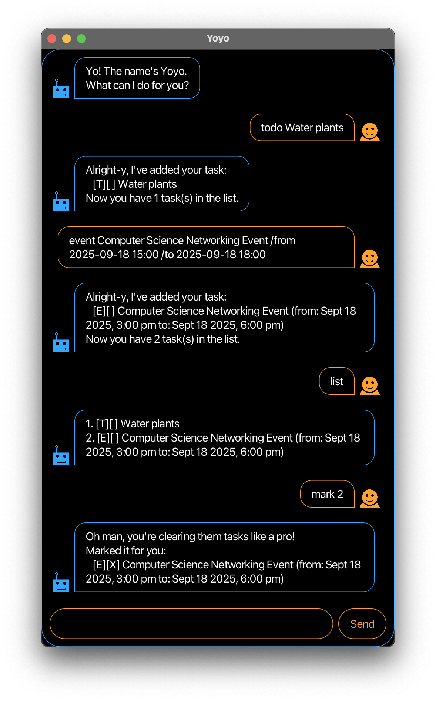

# Yoyo User Guide



Yoyo is a **desktop chat-style app for managing daily tasks optimised 
for use through command line prompts**, while complemented by a Graphical
User Interface (GUI). If you prefer typing commands rather than 
interacting with a GUI, Yoyo can manage your tasks faster
than traditional GUI apps.

- Features
  - [Adding to-do: `todo`](#adding-to-do-todo)
  - [Adding deadline: `deadline`](#adding-deadline-deadline)
  - [Adding event: `event`](#adding-event-event)
  - [Listing all tasks: `list`](#listing-all-tasks-list)
  - [Marking a task as done: `mark`](#marking-a-task-as-done-mark)
  - [Marking a task as undone: `unmark`](#marking-a-task-as-undone-unmark)
  - [Deleting a task: `delete`](#deleting-a-task-delete)
  - [Locating tasks by name: `find`](#locating-tasks-by-name-find)
  - [Exiting the program: `bye`](#exiting-the-program-bye)

---

## Adding to-do: `todo`

Adds a to-do task to Yoyo.

Format: `todo DESCRIPTION`

### Example: 
`todo Clean up desk`

Yoyo responds and adds a to-do task with description 'Clean up desk':

```
Alright-y, I've added your task:
   [T][] Clean up desk
Now you have 1 task(s) in the list.
```

## Adding deadline: `deadline`

Adds a deadline task to Yoyo.

Format: `deadline DESCRIPTION /by BYDATE`

### Example:
`deadline Complete calculus tutorial sheet /by 2025-10-03 13:00`

Yoyo responds and adds a deadline task with description 'Complete calculus 
tutorial sheet' and by-date 'Oct 03 2025, 1:00pm':

```
Alright-y, I've added your task:
   [D][] Complete calculus tutorial sheet (by: Oct 03 2025, 1:00pm)
Now you have 1 task(s) in the list.
```

## Adding event: `event`

Adds an event task to Yoyo.

Format: `event DESCRIPTION /from FROMDATE /to TODATE`

### Example:
`event Career Communication Workshop /from 2025-10-03 13:00 
/to 2025-10-03 15:00`

Yoyo responds and adds an event task with description 'Career 
Communication Workshop', from-date 'Oct 03 2025, 1:00pm' and 
to-date 'Oct 03 2025, 3:00pm':

```
Alright-y, I've added your task:
   [E][] Career Communication Workshop (from: Oct 03 2025, 1:00pm 
   to: Oct 03 2025, 3:00pm)
Now you have 1 task(s) in the list.
```

## Listing all tasks: `list`

Shows a list of all tasks being tracked.

Format: `list`

## Marking a task as done: `mark`

Marks the specified task as done. 

Format: `mark TASKINDEX`

`TASKINDEX` corresponds to the index of the task in the list
from the [`list` command](#listing-all-tasks-list).

### Example: 
`mark 2`

Yoyo responds and marks the second task in the list with an X:

```
Oh man, you're clearing them tasks like a pro!
Marked it for you:
   [T][X] Clean up desk
```

## Marking a task as undone: `unmark`

Marks the specified task as undone. 

Format: `unmark TASKINDEX`

`TASKINDEX` corresponds to the index of the task in the list
from the [`list` command](#listing-all-tasks-list)).

### Example:
`unmark 2`

Yoyo responds and unmarks the second task in the list by removing the X:

```
Bruh... Alright fine, I won't judge!
Unmarked it for you:
   [T][] Clean up desk
```
## Deleting a task: `delete`

Deletes the specified task from Yoyo. 

Format: `delete TASKINDEX`

`TASKINDEX` corresponds to the index of the task in the list
from the [`list` command](#listing-all-tasks-list)).

### Example:
`delete 2`

Yoyo responds and deletes the second task in the list:

```
Gotcha, it's gone! I've deleted this task:
   [T][] Clean up desk
Now you have 1 task(s) in the list.
```

## Locating tasks by name: `find`

Finds tasks with names that match the given keyword exactly.

Format: `find KEYWORD`

- The search is case-sensitive. eg. `workshop` will not match
`Workshop`
- Only task names that match `KEYWORD` exactly will be located.

### Example:
`find computing event`

Yoyo responds with the tasks in its list that have a name 
containing the keyword 'computing event':

```
1. [E][] NUS hackathon computing event (from: Oct 03 2025, 1:00pm 
   to: Oct 03 2025, 3:00pm)
2. [E][X} Networking computing event (from: Nov 01 2025, 4:00pm 
   to: Nov 01 2025, 8:00pm)
```

## Exiting the program: `bye`
Exits the program.

Format: `bye`